# NBA Marketing Agentic AI Dashboard

An agentic AI system designed to revolutionize fan engagement for NBA marketing directors. This tool provides automated fan sentiment analysis, AI-driven event planning, and predictive trend forecasting to make planning easy and reliable.
You can try out this tool via the link:
https://nbamarketingapp.streamlit.app/

## 🎯 Target User
**Senior NBA Marketing Director** - Experience "relief" and "easy, reliable planning" through AI-powered insights.

## 🏗️ Architecture

### The Coordinator Agent (The Manager)
- **Framework**: BeeAI Workflow
- **Role**: Analyzes director requests and delegates to specialist agents
- **Communication**: Uses Agent Communication Protocol (ACP)

```mermaid
graph TB
    %% User Interface
    User(["🎯 Senior NBA Marketing Director<br/>Natural Language Queries"])
    
    %% Coordinator Agent
    CA[("🤖 Coordinator Agent<br/>Manager/BeeAI Workflow<br/>- Request Analysis<br/>- Task Delegation<br/>- Response Synthesis")]
    class CA coordinator
    
    %% Specialist Agents
    SA[("📊 Sentiment Agent<br/>Fan Analysis Specialist<br/>- Sentiment Analysis<br/>- Data Retrieval<br/>- Pattern Recognition")]
    class SA specialist
    
    CA1[("🎨 Creative Agent<br/>Content Generation Specialist<br/>- Content Creation<br/>- Event Planning<br/>- Creative Prompting")]
    class CA1 specialist
    
    PA[("🔮 Predictive Agent<br/>Trend Forecasting Specialist<br/>- Predictive Modeling<br/>- Trend Analysis<br/>- Strategic Planning")]
    class PA specialist
    
    %% Tools Layer
    RT[("🔍 RAG Tool<br/>Knowledge Retrieval<br/>- Fan Reports<br/>- Historical Data")]
    class RT tool
    
    DT[("📈 Data Tool<br/>Data Analysis<br/>- Fan Comments<br/>- Game Performance<br/>- Engagement Metrics")]
    class DT tool
    
    WT[("🧠 Watsonx Tool<br/>IBM watsonx.ai Integration<br/>- Granite/Llama Models<br/>- Content Generation<br/>- API Management")]
    class WT tool
    
    FT[("📊 Forecast Tool<br/>Predictive Analytics<br/>- Trend Forecasting<br/>- Behavior Prediction<br/>- Strategic Insights")]
    class FT tool
    
    %% Data Sources
    FC[("💬 Fan Comments DB<br/>JSON Database<br/>- Platform Data<br/>- Sentiment Labels<br/>- Engagement Metrics")]
    class FC data
    
    GD[("🏀 Game Data<br/>Performance Database<br/>- Player Stats<br/>- Game Results<br/>- Highlights")]
    class GD data
    
    HD[("📚 Historical Data<br/>Trend Database<br/>- Engagement History<br/>- Fan Behavior<br/>- Performance Trends")]
    class HD data
    
    %% Knowledge Base
    KB[("📖 Knowledge Base<br/>- Fan Reports (PDF)<br/>- Historical Data (DOCX)<br/>- Insights & Analysis")]
    class KB data
    
    %% External Services
    WX[("☁️ IBM watsonx.ai<br/>Cloud Platform<br/>- Granite Models<br/>- Llama Models<br/>- API Access")]
    class WX external
    
    %% BeeAI Framework
    BF[("🐝 BeeAI Framework<br/>- Agent Communication Protocol<br/>- Workflow Management<br/>- Task Coordination")]
    class BF external
    
    %% Connections
    User --> CA
    
    CA --> SA
    CA --> CA1  
    CA --> PA
    
    SA --> RT
    SA --> DT
    
    CA1 --> WT
    CA1 --> DT
    
    PA --> FT
    PA --> DT
    
    RT --> KB
    DT --> FC
    DT --> GD
    DT --> HD
    
    WT --> WX
    FT --> HD
    
    BF -.-> CA
    BF -.-> SA
    BF -.-> CA1
    BF -.-> PA
    
    %% Subgraphs for organization
    subgraph "🎯 User Interface Layer"
        User
    end
    
    subgraph "🤖 Agent Layer"
        CA
        SA
        CA1
        PA
    end
    
    subgraph "🛠️ Tools Layer"
        RT
        DT
        WT
        FT
    end
    
    subgraph "💾 Data Layer"
        FC
        GD
        HD
        KB
    end
    
    subgraph "☁️ External Services"
        WX
        BF
    end
```




### Specialist Agents (The Team)

1. **SentimentAgent** - Fan Sentiment Analysis
   - Uses RAG and Data Analysis tools
   - Analyzes fan posts and comments
   - Provides insights on fan needs

2. **CreativeAgent** - Content Generation
   - Uses IBM watsonx.ai (Granite models)
   - Generates content hooks and event suggestions
   - Creates compelling marketing materials

3. **PredictiveAgent** - Trend Forecasting
   - Uses predictive analytics
   - Forecasts fan behavior and trends
   - Provides strategic recommendations

## 🚀 Features

### Automated Fan Sentiment Analysis
- Understand fan needs through post analysis
- Real-time sentiment monitoring
- Platform-specific engagement insights

### AI-Driven Event & Content Planning
- Content hooks based on recent performances
- Event planning recommendations
- Automated creative content generation

### Predictive Trend Forecasting
- Future fan behavior analysis
- Competitive advantage insights
- Strategic planning support

## 🛠️ Installation

1. Clone the repository

```bash
git clone https://github.com/Alvin9840/NBA-Marketing-AI-Dashboard.git
```

2. Install dependencies:

```bash  
pip install -r requirements.txt
```

3. Set up your Streamlit secrets file:

Create a `.streamlit/secrets.toml` file in your project root:

```toml
[watsonx]
api_key = "your_ibm_watsonx_api_key_here"
url = "https://us-south.ml.cloud.ibm.com"
project_id = "your_project_id_here"

[models]
coordinator_id = "ibm/granite-3-8b-instruct"
predictive_id = "meta-llama/llama-3-3-70b-instruct"
sentiment_id = "meta-llama/llama-3-3-70b-instruct"

[models.coordinator_parameters]
decoding_method = "greedy"
max_new_tokens = 2000
temperature = 0.1
top_p = 0.9
top_k = 50

[models.predictive_parameters]
decoding_method = "greedy"
max_new_tokens = 1500
temperature = 0.3
repetition_penalty = 1.1

[models.sentiment_parameters]
decoding_method = "greedy"
max_new_tokens = 1500
min_new_tokens = 1
temperature = 0.3
top_k = 50
top_p = 0.9
repetition_penalty = 1.2
```

**⚠️ Security Note**: Add `.streamlit/secrets.toml` to your `.gitignore` file to prevent committing sensitive credentials.

4. Run the application:

```bash  
streamlit run streamlit_frontend.py
```

## 🎮 Usage

### Interactive Mode
python main.py### Demo Mode
python main.py demo### Example Queries
- "Summarize what fans are saying about our last game and suggest content hooks"
- "What are fans saying about the Lakers vs Warriors game?"
- "Generate content hooks based on recent performances"
- "Analyze future trends and forecast fan behavior"

## 📊 Sample Data

The tool includes mock data for:
- Fan comments from various platforms (Twitter, Reddit, Instagram, etc.)
- Game performance data
- Historical engagement trends

## 🔧 Configuration

- `config.py`: Application
- `config/beeai_config.yaml`: BeeAI workflow configuration
- `config/saiber_tools.yaml`: Tool endpoints and parameters
- `data/`: Sample data files
- `knowledge/`: Knowledge base files (mock)

## 🤖 AI Foundation

Built on **BeeAI Framework** and **IBM watsonx.ai**:
- **Backend Brain**: IBM Granite models for reasoning and generation
- **Agent Communication**: Structured protocol for agent coordination
- **Tool Integration**: Seamless connection to data sources and AI models

## 📈 Benefits

✅ **Relief**: Automated insights reduce manual research burden  
✅ **Easy Planning**: AI-generated recommendations simplify decision-making  
✅ **Reliable**: Data-driven predictions increase confidence  
✅ **Competitive Advantage**: Stay ahead with predictive analytics  
✅ **Scalable**: Handles multiple games and fan interactions simultaneously  

## 🔒 Privacy & Ethics

- All fan data handling follows NBA privacy guidelines
- Sentiment analysis respects user consent
- Predictive models use aggregated, anonymized data
- Content generation avoids harmful or biased outputs
